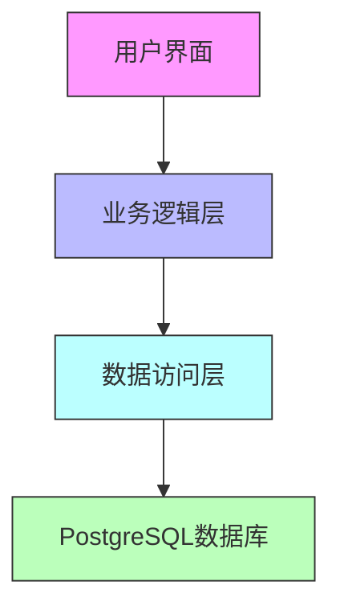
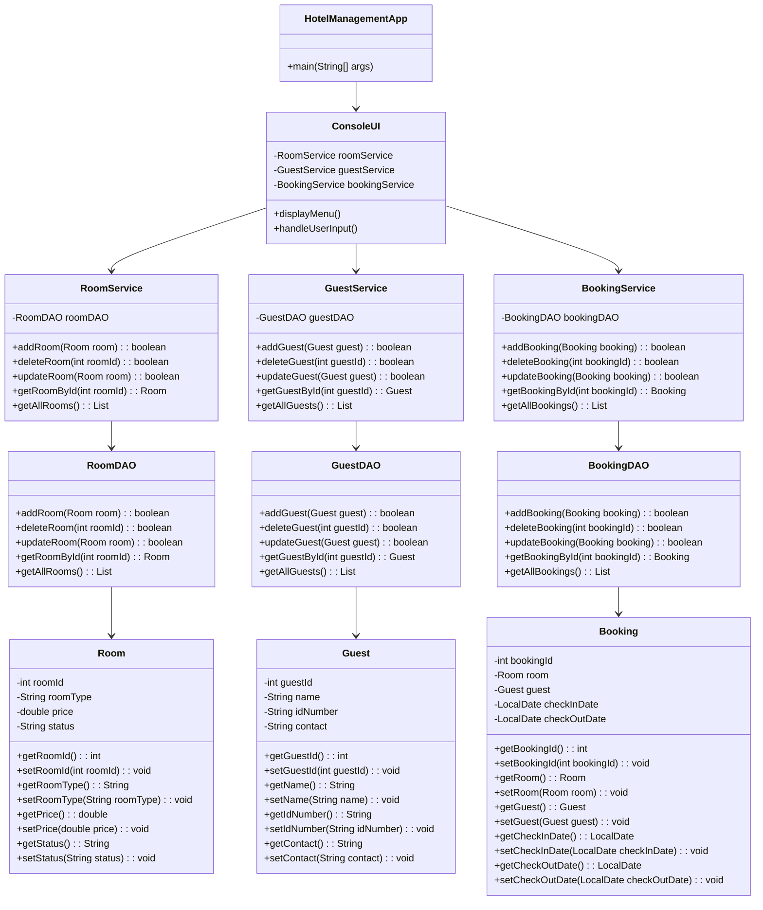

# 酒店住宿管理系统（Hotel Accommodation Management System）

<!DOCTYPE html>
<html lang="zh-CN">
<head>
    <meta charset="UTF-8">
    <meta name="viewport" content="width=device-width, initial-scale=1.0">
    
</head>
<body>
    <div align="center">
         
        <h2>智能、高效的酒店运营管理解决方案</h2>
    </div>
</body>
</html>

---

## 项目概述
本系统是一款基于Java开发的企业级酒店住宿管理系统，专为中小型酒店量身打造。凭借先进的技术架构和模块化设计，系统实现了房间信息管理、房型价格调整、客人信息登记、入住/退房结算等核心功能，全面助力酒店提升运营效率与服务质量。

---

## 核心功能亮点
| 功能模块       | 功能描述                                                                 | 优势体现                          |
|----------------|--------------------------------------------------------------------------|-----------------------------------|
| 房间管理       | 支持房间的增删改查、房型配置、状态管理及价格调整                         | 灵活配置房间资源，实时掌握房间状态 |
| 价格管理       | 可调整房型基础价格并记录价格调整历史                                     | 方便价格策略制定与审计            |
| 客人管理       | 客人信息的增删改查，包含身份证号唯一性校验                               | 保障客人信息准确、安全            |
| 房费结算       | 入住登记时校验房间状态，退房时自动计算房费                               | 结算高效准确，减少人工失误        |

---

## 技术架构图


## 类图设计


---

## 系统架构
| 层次       | 技术/工具                  | 说明                          |
|------------|---------------------------|-------------------------------|
| 数据库层   | PostgreSQL 12+            | 存储房间、客人、入住记录等数据 |
| 数据访问层 | JDBC                      | 数据库连接与CRUD操作          |
| 业务逻辑层 | Java（分层架构）          | 包含状态校验、数据合法性检查  |
| 交互层     | 控制台（命令行界面）       | 提供用户操作入口              |

---

## 项目目录结构
```plaintext
项目根目录
├── database/          # 数据库初始化脚本
│   └── init.sql       # 建库建表及初始数据
├── src/               # Java源代码
│   └── com/hotel/     # 主包
│       ├── entity/    # 实体类（映射数据库表）
│       ├── dao/       # 数据访问层（数据库操作）
│       ├── service/   # 业务逻辑层（核心业务处理）
│       └── ui/        # 控制台交互层（用户界面）
├── RUNNING.md         # 运行指南（环境配置、编译运行步骤）
└── README.md          # 项目说明文档（当前文件）
```

---

## 快速启动指南
完整运行步骤请参考 [`RUNNING.md`](RUNNING.md)，核心流程如下：
1. 安装并启动PostgreSQL数据库
2. 执行 `database/init.sql` 初始化数据库
3. 修改 `src/com/hotel/dao/util/JdbcUtil.java` 中的数据库连接参数
4. 编译项目（需Java 8+及PostgreSQL JDBC驱动）
5. 运行 `com.hotel.ui.HotelManagementApp` 启动系统

---

## 贡献方式
欢迎通过以下方式参与项目改进：
- 提交Issue反馈BUG或功能需求
- 提交Pull Request修复代码或添加新功能
- 完善文档（如补充测试用例、优化用户指南）

---

## 许可证
本项目采用MIT许可证，详见 `LICENSE` 文件。