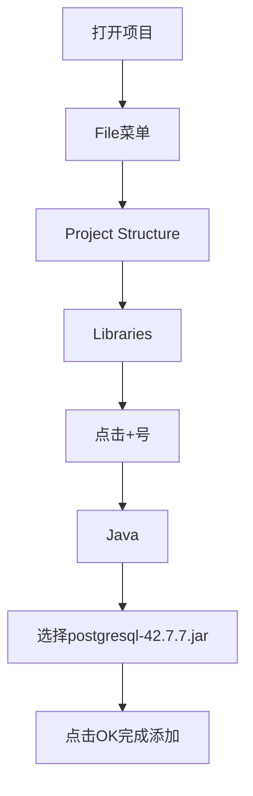
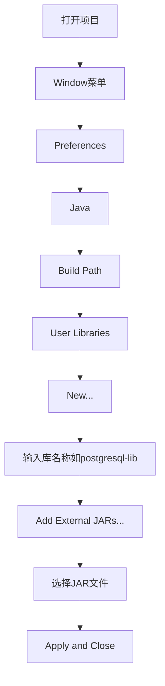

# 酒店住宿管理系统运行指南

## 📋 目录
- [环境要求](#环境要求)
- [数据库初始化](#数据库初始化)
- [项目配置](#项目配置)
- [IDE环境设置](#ide环境设置)
- [编译与运行](#编译与运行)
- [常见问题排查](#常见问题排查)
- [扩展功能配置](#扩展功能配置)
- [维护与更新](#维护与更新)

## 环境要求
| 软件/工具 | 版本要求 | 作用 | 下载链接 |
|-----------|----------|------|----------|
| JDK | 1.8+ | Java程序编译与运行环境 | [Oracle JDK](https://www.oracle.com/java/technologies/downloads/) 或 [OpenJDK](https://adoptium.net/) |
| PostgreSQL | 12+ | 关系型数据库服务 | [PostgreSQL官网](https://www.postgresql.org/download/) |
| PostgreSQL JDBC驱动 | 42.7.7+ | 数据库连接驱动 | [JDBC驱动下载](https://jdbc.postgresql.org/download/) |
| IDE（可选） | IntelliJ IDEA 2020+ 或 Eclipse 2020+ | 代码编辑与项目管理 | [IntelliJ](https://www.jetbrains.com/idea/) / [Eclipse](https://www.eclipse.org/downloads/) |

> ⚠️ 验证环境：安装完成后可通过以下命令检查版本
> ```cmd
> java -version          # 应显示1.8.0_xxx或更高版本
> psql --version         # 应显示psql (PostgreSQL) 12.x或更高版本
> ```

## 数据库初始化
### 流程概览


### 详细步骤
1. **启动数据库服务**
   - Windows服务方式：`Win+R` → 输入`services.msc` → 找到`PostgreSQL`服务并启动
   - 命令行方式：
     ```cmd
     net start postgresql-x64-12  # 根据安装版本调整服务名
     ```

2. **执行初始化脚本**
   - **方法1（图形界面）**：
     1. 打开pgAdmin → 连接到PostgreSQL服务器
     2. 右键点击`Databases` → `Query Tool`
     3. 打开项目中的`database/init.sql`文件
     4. 点击执行按钮（▶️）运行整个脚本
   
   - **方法2（命令行）**：
     ```cmd
     psql -U postgres -d postgres -f "Hotel-Accommodation-Management-System-main/database/init.sql"
     ```

3. **验证数据库创建**
   ```sql
   -- 连接到新创建的数据库
   \c hotel_management
   
   -- 查看所有表
   \dt
   ```

4. **确认测试数据插入**
   ```sql
   -- 查看房间表数据
   SELECT * FROM room LIMIT 5;
   
   -- 查看客人表数据
   SELECT * FROM guest LIMIT 5;
   ```

## 项目配置
### 数据库连接配置
1. 打开 `src/com/hotel/dao/util/JdbcUtil.java` 文件
2. 修改以下连接参数（根据本地PostgreSQL配置调整）：
   ```java
   private static final String URL = "jdbc:postgresql://localhost:5432/hotel_management"; // 数据库URL
   private static final String USER = "postgres"; // 数据库用户名
   private static final String PASSWORD = "your_password"; // 数据库密码
   ```

### 日志配置（可选）
项目支持使用Log4j2进行日志管理，配置步骤如下：
1. 在项目根目录创建 `log4j2.xml` 文件
2. 添加以下基础配置：
   ```xml
   <?xml version="1.0" encoding="UTF-8"?>
   <Configuration status="WARN">
       <Appenders>
           <Console name="Console" target="SYSTEM_OUT">
               <PatternLayout pattern="%d{HH:mm:ss.SSS} [%t] %-5level %logger{36} - %msg%n"/>
           </Console>
       </Appenders>
       <Loggers>
           <Root level="info">
               <AppenderRef ref="Console"/>
           </Root>
       </Loggers>
   </Configuration>
   ```

## IDE环境设置
### 添加JDBC驱动JAR文件
#### IntelliJ IDEA


详细步骤：
1. 打开项目后，点击顶部菜单栏 **File** → **Project Structure**（或按`Ctrl+Alt+Shift+S`）
2. 在左侧面板选择 **Libraries**
3. 点击右上角 **+** 图标，选择 **Java**
4. 导航到项目根目录，选择 `postgresql-42.7.7.jar` 文件
5. 点击 **OK** 完成添加，确保驱动出现在库列表中

#### Eclipse


详细步骤：
1. 点击顶部菜单栏 **Window** → **Preferences**
2. 展开 **Java** → **Build Path** → **User Libraries**
3. 点击 **New...**，输入库名称（如`postgresql-lib`），点击 **OK**
4. 选中新建的库，点击 **Add External JARs...**
5. 导航到项目根目录，选择 `postgresql-42.7.7.jar` 文件
6. 点击 **Apply and Close** 完成配置
7. 右键项目 → **Build Path** → **Add Libraries** → 选择刚才创建的用户库

## 编译与运行
### 命令行方式
1. **编译项目**
   ```cmd
   cd Hotel-Accommodation-Management-System-main
   mkdir bin  # 创建编译输出目录
   javac -cp postgresql-42.7.7.jar -d bin src/com/hotel/**/*.java
   ```
   > 参数说明：`-cp` 指定类路径（包含JDBC驱动），`-d` 指定编译输出目录

2. **运行程序**
   ```cmd
   java -cp bin;postgresql-42.7.7.jar com.hotel.ui.HotelManagementApp
   ```
   > Windows系统类路径分隔符为`;`，Linux/macOS为`:`

### IDE运行方式
#### IntelliJ IDEA
1. 找到主类：`src/com/hotel/ui/HotelManagementApp.java`
2. 右键文件 → **Run 'HotelManagementApp.main()'**
3. 首次运行可能需要配置运行参数：
   - 点击运行配置下拉框 → **Edit Configurations**
   - 在 **VM options** 中确保类路径正确
   - 点击 **Apply** 后再次运行

#### Eclipse
1. 找到主类：`src/com/hotel/ui/HotelManagementApp.java`
2. 右键文件 → **Run As** → **Java Application**
3. 若提示类找不到，检查：
   - 右键项目 → **Properties** → **Java Build Path** → **Libraries**
   - 确保已添加PostgreSQL驱动JAR

## 常见问题排查
| 问题现象 | 可能原因 | 解决方案 |
|----------|----------|----------|
| 数据库连接失败 | 连接参数错误 | 检查`JdbcUtil.java`中的URL、用户名、密码是否正确 |
|  | PostgreSQL服务未启动 | 执行`net start postgresql-x64-12`启动服务 |
|  | 端口被占用 | 更改`postgresql.conf`中的端口配置或关闭占用程序 |
| 类找不到错误 | JDBC驱动未添加 | 重新检查IDE中的JAR添加步骤或命令行`-cp`参数 |
|  | 编译路径错误 | 确保编译命令中的`-d bin`参数正确，且源文件路径无误 |
| 表不存在错误 | 未执行初始化脚本 | 重新执行`init.sql`脚本，检查是否有执行错误 |
|  | 数据库名称错误 | 确认URL中的数据库名是否为`hotel_management` |
| 权限不足 | 数据库用户权限不够 | 使用管理员账号执行脚本或为用户授权：`GRANT ALL PRIVILEGES ON DATABASE hotel_management TO your_user;` |
| 编码问题 | 数据库编码不匹配 | 在`init.sql`开头添加`SET client_encoding = 'UTF8';` |
| 日志不输出 | Log4j2配置错误 | 检查`log4j2.xml`文件路径和内容是否正确 |

## 扩展功能配置
### 添加单元测试
1. 在项目根目录创建 `test` 目录
2. 添加 JUnit 5 依赖（需将 JUnit JAR 添加到类路径）
3. 创建测试类，示例如下：
   ```java:/d:/佟雨泽/大二小学期/Hotel-Accommodation-Management-System-main/test/com/hotel/TestRoomService.java
   import org.junit.jupiter.api.Test;
   import static org.junit.jupiter.api.Assertions.*;
   
   class TestRoomService {
       @Test
       void testRoomAddition() {
           // 测试房间添加逻辑
           assertTrue(true);
       }
   }
   ```

### 配置持续集成
在项目根目录创建 `.github/workflows/build.yml` 文件，添加以下配置：
```yaml
name: Java CI

on: [push]

jobs:
  build:
    runs-on: ubuntu-latest
    
    steps:
    - uses: actions/checkout@v2
    - name: Set up JDK 1.8
      uses: actions/setup-java@v1
      with:
        java-version: 1.8
    - name: Build with javac
      run: |
        mkdir bin
        javac -cp postgresql-42.7.7.jar -d bin src/com/hotel/**/*.java
```

## 维护与更新
### 数据库更新
1. 创建新的 SQL 脚本（如 `database/update_1.sql`）
2. 记录数据库变更历史
3. 执行更新脚本：
   ```cmd
   psql -U postgres -d hotel_management -f "Hotel-Accommodation-Management-System-main/database/update_1.sql"
   ```

### 代码更新
1. 从版本控制系统拉取最新代码
2. 重新编译项目
3. 重启程序

---

以上就是酒店住宿管理系统的完整运行指南，在使用过程中遇到任何问题，欢迎通过 [GitHub Issues](https://github.com/tyz20050812tyz/Hotel-Accommodation-Management-System/issues) 反馈。